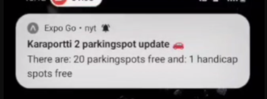

# Park-Spotter
This repository contains code for parking area car detection application. This contains both server backend and expo application code used to see available spots and get notifications on your phone while driving to work. To use the project you will need a server to run the code on and an IP camera. We used Azure for a VM and ran the backend code there.

The project uses a pre-trained machine learning model to search for cars in the image provided by the camera. The current model in use is <a href="https://docs.ultralytics.com/">YOLOv8 by Ultralytics</a>. In our project code the video feed doesn't get saved or uploaded to anywhere and is only processed from the live feed. Ultralytics might collect some usage data and you can read more about it <a href="https://docs.ultralytics.com/help/privacy/">here</a>.


## Screenshots 
  </br>   

## How to get started with the project

### Download python
https://www.python.org/downloads/
Version need to be >= 3.9.x

### Clone repository
```
git clone https://github.com/JerbsH/Park-Spotter.git
```

### Other files needed
.env  file to your project root. This could be basic layout for your file.
We used MariaDB as our server database in our application.
```
#camera URL
SECURE_URL=<Your own stream URL>
# URL for the backend
REACT_PARKINGSPOTS_URL=<Your own URL>/free_spots
REACT_HANDICAP_PARKINGSPOTS_URL=<Your own URL>/free_handicap_spots
REACT_SERVER_URL=<Your own URL>/register

#Database user
DB_USER=""
DB_HOST=""
DB_PASS =""
DB_NAME =""
```
frontend/config.js to your project root. Basic config layout.
You will need a firebase cloud messaging configurations.
<a href="https://firebase.google.com/">Firebase console</a>
Expo documentation for push notifications setup
<a href="https://docs.expo.dev/push-notifications/push-notifications-setup/">Expo push notifications</a>

```
export const firebaseConfig = {
  apiKey: '',
  authDomain: '',
  databaseURL: '',
  projectId: '',
  storageBucket: '',
  messagingSenderId: '',
  appId: '',
};
```

You will need a compatible NodeJs version and npm.
For bash:
```
sudo apt-get update
sudo apt-get install -y nodejs
```
Install npm
```
npm install
```

Locally for example your own PC. Visit https://nodejs.org/en

### Starting the application
Use the correct starting script based on your server operating system.
#### Unix based system
```
bash startapp.sh
```
#### Windows system
```
.\startapp.bat
```

With current configurations


